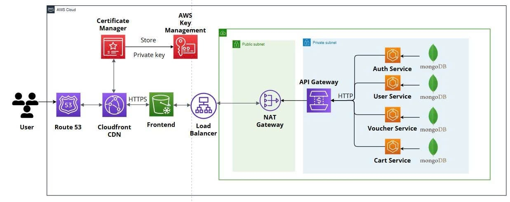

# CLOUD-NATIVE API-BASED NETWORK APPLICATION SECURITY FOR SMALL COMPANY SERVICES

## 📋 Thông tin dự án

**Môn học:** Mật mã học NT219.P21.ANTN  
**Đề tài:** Cloud-Native API-Based Network Application Security for Small Company Services

### 👥 Sinh viên thực hiện

| Họ và tên           | MSSV     |
| ------------------- | -------- |
| Trần Dương Minh Đại | 22520183 |
| Hoàng Ngọc Khánh    | 23520717 |

---

## 🎯 Tổng quan dự án

**Voux Platform** là một hệ thống cloud-native được thiết kế để cung cấp giải pháp bảo mật toàn diện cho các dịch vụ API của công ty nhỏ. Dự án tập trung vào việc triển khai các biện pháp bảo mật hiện đại trong kiến trúc microservices.

### 🔑 Tính năng chính

- **🔐 Hệ thống xác thực và phân quyền (RBAC)** - Role-Based Access Control với JWT tokens
- **🛡️ API Gateway Security** - Centralized security enforcement
- **🔒 End-to-End Encryption** - TLS/SSL và mã hóa dữ liệu
- **📊 Session Management** - Quản lý phiên làm việc an toàn

---

## 🏗️ Kiến trúc hệ thống

### Microservices Architecture




### 🔧 Tech Stack

#### Backend
- **Framework:** FastAPI (Python)
- **Database:** MongoDB Atlas
- **Authentication:** JWT (JSON Web Tokens)
- **Authorization:** RBAC (Role-Based Access Control)
- **Containerization:** Docker

#### Frontend
- **Framework:** React.js
- **Build Tool:** Vite
- **Styling:** CSS3, Modern UI Components

#### DevOps & Security
- **SSL/TLS:** Let's Encrypt certificates
- **Container Orchestration:** Docker Compose
- **API Gateway:** Custom FastAPI gateway
- **Monitoring:** Built-in logging and health checks

---

## 🔒 Tính năng bảo mật

### 1. Authentication & Authorization
- **JWT-based authentication** với refresh tokens
- **Role-Based Access Control (RBAC)** với 6 cấp độ:
  - `GUEST` - Quyền xem cơ bản
  - `USER` - Quyền người dùng thông thường
  - `VOUCHER_CREATOR` - Tạo và quản lý voucher
  - `MODERATOR` - Kiểm duyệt nội dung
  - `ADMIN` - Quản trị hệ thống
  - `SUPER_ADMIN` - Toàn quyền hệ thống

### 2. API Security
- **Rate limiting** để chống DDoS
- **Input validation** và sanitization
- **CORS policy** được cấu hình chặt chẽ
- **Request/Response encryption**

### 3. Data Protection
- **Database encryption** với MongoDB Atlas
- **Sensitive data masking** trong logs
- **Secure session management**
- **Password hashing** với bcrypt

### 4. Network Security
- **TLS 1.3 encryption** cho tất cả communications
- **Certificate pinning**
- **Secure headers** (HSTS, CSP, X-Frame-Options)

---

## 🚀 Cài đặt và triển khai

### Yêu cầu hệ thống
- **Python 3.11+**
- **Node.js 18+**
- **Docker & Docker Compose**
- **MongoDB Atlas account**

### 1. Clone repository
```bash
git clone <repository-url>
cd Voux
```

### 2. Cấu hình environment
```bash
# Copy và chỉnh sửa file .env
cp .env.example .env

# Cấu hình MongoDB Atlas connection
# Cấu hình JWT secrets
# Cấu hình SSL certificates
```

### 3. Khởi chạy với Docker
```bash
# Build và start tất cả services
docker-compose up -d

# Hoặc chạy từng service riêng lẻ
cd microservice-python
python run-api-gateway.py
python run-auth-service.py
python run-user-service.py
python run-cart-service.py
python run-voucher-service.py
```

### 4. Khởi chạy Frontend
```bash
cd Front-end
npm install
npm run dev
```

---

## 📊 API Documentation

### Authentication Endpoints
```
POST /api/auth/login          # Đăng nhập
POST /api/auth/register       # Đăng ký
POST /api/auth/refresh        # Refresh token
POST /api/auth/logout         # Đăng xuất
```

### User Management
```
GET  /api/users/              # Lấy danh sách users (Admin)
GET  /api/users/{id}          # Lấy thông tin user
PUT  /api/users/{id}          # Cập nhật user
DELETE /api/users/{id}        # Xóa user (Admin)
```

### Voucher Management
```
GET  /api/vouchers/           # Lấy danh sách vouchers
POST /api/vouchers/           # Tạo voucher mới
PUT  /api/vouchers/{id}       # Cập nhật voucher
DELETE /api/vouchers/{id}     # Xóa voucher
```

### Cart Management
```
GET  /api/cart/               # Lấy giỏ hàng
POST /api/cart/items          # Thêm item vào giỏ
PUT  /api/cart/items/{id}     # Cập nhật item
DELETE /api/cart/items/{id}   # Xóa item
```

---

## 🧪 Testing

### Security Testing
```bash
# Chạy security tests
python test_database_security.py
python test_rbac_system.py
python test_session_security.py
```

### API Testing
```bash
# Test các API endpoints
python quick-test-api.py
python test-cart-api.py
python test-voucher-api.py
```

### Load Testing
```bash
# Performance và security testing
python test_security_api.py
```

---

## 📈 Monitoring & Logging

### Health Checks
- **Service health endpoints**: `/health`
- **Database connectivity**: Automatic monitoring
- **JWT token validation**: Real-time verification

### Security Monitoring
- **Failed authentication attempts**
- **Suspicious API calls**
- **Rate limiting violations**
- **Permission escalation attempts**

---

## 🔧 Configuration

### Environment Variables
```env
# Database
MONGODB_URI=mongodb+srv://...
DATABASE_NAME=voux_platform

# JWT Configuration
JWT_SECRET_KEY=your-secret-key
JWT_ALGORITHM=HS256
JWT_EXPIRATION_HOURS=24

# API Configuration
API_GATEWAY_PORT=8000
AUTH_SERVICE_PORT=8050
USER_SERVICE_PORT=8060
CART_SERVICE_PORT=8070
VOUCHER_SERVICE_PORT=8080

# Security
CORS_ORIGINS=["http://localhost:3000"]
RATE_LIMIT_PER_MINUTE=100
```

---

## 📚 Tài liệu tham khảo

### Security Standards
- **OWASP API Security Top 10**
- **NIST Cybersecurity Framework**
- **ISO 27001 Information Security**

### Technical Documentation
- [FastAPI Security](https://fastapi.tiangolo.com/tutorial/security/)
- [JWT Best Practices](https://tools.ietf.org/html/rfc7519)
- [MongoDB Security](https://docs.mongodb.com/manual/security/)

---

---

## 📄 License

Dự án này được phát triển cho mục đích học tập trong môn Mật mã học NT219.P21.ANTN.

---

*© 2025 Voux Platform - Cloud-Native API Security Project*